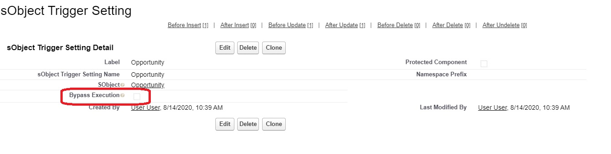
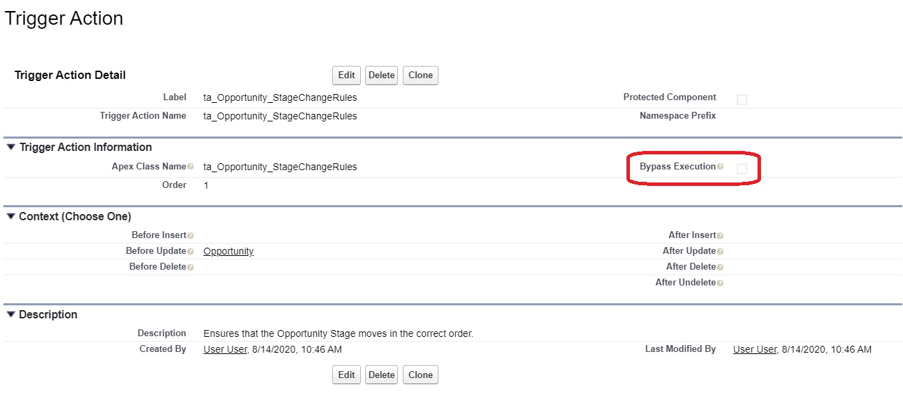

# Salesforce Trigger Actions Framework

This project is meant to demonstrate an Apex Trigger Framework which is built with the following goals in mind:

1. Single Trigger per sObject
2. Logic-less Triggers
3. Context Specific Implementation
4. Easy to Migrate Existing Code
5. Simple Unit Testing
6. Configuration from Setup Menu
7. Adherance to SOLID Principles


## Build a Solid Base

This one is a no brainer, but there should only be one Apex Trigger written in your Salesforce org per sObject.

There is another well known truth amongst Salesforce developers: it is wise to partition your trigger from the logic that must be executed. Leaving logic within the Trigger itself leads to code which is extremely difficult to test, maintain, and understand.

In order to achieve this, we must define a `TriggerBase` class, and extend that class. For this example, we will create a class called `OpportunityTriggerHandler`.

```java
public virtual class TriggerBase {
  ...
}
```

```java
public class OpportunityTriggerHandler extends TriggerBase {
  ...
}
```

```java
Trigger OppportunityTrigger on Opportunity (before insert, after insert, before update, after update, before delete, after delete, after undelete) {
    new OpportunityTriggerHandler().run();
}
```

We will get more into the body of the `TriggerBase` class shortly.

Developers are familiar with having a method named `beforeUpdate` for example. This is what we mean when we say context specific implementation. Many trigger frameworks provide an virtual method to be overridden by the specific handler for each context. We will choose to define these methods as interfaces within our `TriggerAction` class. This will allow us some very nice perks when it comes time to unit test our code.

```java
public class TriggerAction {

	public interface BeforeInsert {
		void beforeInsert(List<SObject> newList);
	}

	public interface BeforeUpdate {
		void beforeUpdate(List<SObject> newList, List<SObject> oldList);
	}

	...

}

```

Now that the foundations are set, we can take a closer look into the `run()` method of `TriggerBase` to get a better understanding of how this all works together.

```java
public void run() {

	...

	if (this.context == System.TriggerOperation.BEFORE_INSERT && this instanceof TriggerAction.BeforeInsert ) {
		((TriggerAction.BeforeInsert)this).beforeInsert(triggerNew);
	}
	...
	else if (this.context == System.TriggerOperation.BEFORE_UPDATE && this instanceof TriggerAction.BeforeUpdate) {
		((TriggerAction.BeforeUpdate)this).beforeUpdate(triggerNew, triggerOld);
	}

    ...

	}
```

The check to see if `this` is an instance of any of those `TriggerAction` interfaces we specified earlier, in addition to the check of the context, allows us to specify the implementation context completely within the handler class definition. For example:

```java
public class OpportunityTriggerHandler extends TriggerBase implements TriggerAction.BeforeInsert {

	@TestVisible
  	private static final String YUGE_DEAL = 'Yuuuuuge Deal';

    public void beforeInsert(List<Opportunity> newList){
      	for (Opportunity opp : newList) {
			opp.Name = YUGE_DEAL;
      	}
    }
}

```

Note that our beforeInsert method accepts `List<Opportunity>` instead of a `List<SObject>` - this is made possible by the `TriggerAction` interfaces. This is nice because there is no need to downcast `Trigger.new` in this framework as was the case in so many which came before it.

This is great. We have successfully partitioned the Trigger framework from the logic in a repeatable way. This has been the place where the abstraction stops for writing triggers on the Salesforce platform for years, but it does not to adhere to all **SOLID**  principles:


|   | Principle                       | Definition                                                                                |
|---|---------------------------------|-------------------------------------------------------------------------------------------|
| S | Single Responsibility principle | A class should have a single responsibility                                               |
| O | Open-Closed principle           | Classes should be open for extension but closed for modification                          |
| L | Liskov Substitution principle   | An instance of a class should be able to be interchanged with an instance of its subclass |
| I | Interface Segregation principle | Many client-specific interfaces are better than one general purpose interface             |
| D | Dependency Inversion principle  | It is better to depend upon abstractions (interfaces) rather than concretions             |

The `OpportunityTriggerHandler` class is responsible for *all* trigger logic on the Opportunity sObject and reqires modification for every new piece of triggered functionality which violates the **Single Responsibility principle** and the **Open-Closed principle**. Oftentimes the `OpportunityTriggerHandler` class becomes so large it gets unmaintainable and difficult to work on across multiple teams. We want to create a framework which allows for *extension* rather than *modification* of our trigger handler classes. Additionally, we want to author classes which have a single responsibility.


## Metadata Driven Trigger Actions

We can achieve our goal of adhering to **SOLID** principles for our trigger framework by making some slight modifications. Instead of defining the `OpportunityTriggerHandler` class like we did above, we will use the `MetadataTriggerHandler` class which is included in this project.

```java
Trigger OppportunityTrigger on Opportunity (before insert, after insert, before update, after update, before delete, after delete, after undelete) {
    new MetadataTriggerHandler().run();
}
```

This class allows us to now use custom metadata to configure a few things from the setup menu:

- The sObject and context for which an action is supposed to execute
- The order to take those actions within a given context
- A checkbox to bypass execution at the sObject or trigger action level


The setup menu gives you a nice view of all of the actions that are executed when a record is inserted, updated, deleted, or undeleted.

The `MetadataTriggerHandler` class fetches all Trigger Action metadata that is configured in the org, and dynamically create an instance of an object which implements a `TriggerAction` interface and casts it to the appropriate interface as specified in the metadata, then calls their respective context methods in the order specified.

```java
...
TriggerAction.BeforeInsert action = (TriggerAction.BeforeInsert)(Type.forName(triggerMetadata.Apex_Class_Name__c).newInstance()));
...

for (TriggerAction.BeforeInsert action : beforeInsertActions) {
    action.BeforeInsert(newList);
}
...
```
Note that if an Apex class is specified in metadata and it does not exist or does not implement the correct interface, a runtime error will occur.

This allows for extra freedom and configuration from the setup menu, but it also allows us to do something which I think is pretty amazing: we can now define a class for each specific trigger action that we want to implement.

```java
public class ta_Opportunity_StageInsertRules implements TriggerAction.BeforeInsert {

    @TestVisible
    private static final String INVALID_STAGE_INSERT_ERROR = 'The Stage must be \'' +  Constants.OPPORTUNITY_STAGENAME_PROSPECTING + '\' when an Opportunity is created';

    public void beforeInsert(List<Opportunity> newList){
	for (Opportunity opp : newList) {
            if (opp.StageName != Constants.OPPORTUNITY_STAGENAME_PROSPECTING) {
                opp.addError(INVALID_STAGE_INSERT_ERROR);
            }
        }
    }
}

```

Now, as future development work gets completed, we won't need to keep modifying the bodies of our triggerHandler classes, we can just create a new class per piece of functionality that we want and configure those to run in a specified order.


With this multiplicity of Apex classes, it would be wise to follow a naming convention such as `ta_ObjectName_Description` and utilize the `sfdx-project.json` file to partition your application into multiple directories. In the example indluded in this sample project.

```javascript
{
  "packageDirectories": [
    {
      "path": "application/base",
      "default": true
    },
    {
      "path": "application/opportunity-automation",
      "default": false
    }
  ],
  "namespace": "",
  "sfdcLoginUrl": "https://login.salesforce.com",
  "sourceApiVersion": "48.0"
}
```

## Use of Trigger Maps

You may have noticed that the defined interfaces within the `TriggerAction` class do not accept a `Map<Id,sObject>` as an argument. This is because Apex does not permit for the use of generics which would allow us to specify the interfaces with an argument of type `Map<Id, ? extends sObject>`. Without the implementation of generics within the Apex language, we would have to downcast the keys of every map that we want to use to its particular sObject type:

```java
private void someMethod(Map<Id,sObject> sobjectMap) {
	Map<Id,Opportunity> opportunityMap = (Map<Id,Opportunity>)sobjectMap;
}
```

This could potentially break if called with a map of the incorrect sObject type.
To avoid this scenario, we can simply construct a new map out of our `newList` or `oldList` variables:

```java
public void beforeUpdate(List<Opportunity> newList, List<Opportunity> oldList) {
	Map<Id,Opportunity> newMap = new Map<Id,Opportunity>(newList);
	Map<Id,Opportunity> oldMap = new Map<Id,Opportunity>(oldList);
	...
}
```

This will help the transition process if you are migrating an existing Salesforce application to this new trigger actions framework.

## Bypass Mechanisms

Sometimes, you want to bypass trigger execution. It could be for a bulk data load during off-peak hours, but it could be that you have a newly found exception in your business use case that is not supposed to execute code that otherwise would be. There are two types of bypasses built into this Apex Trigger Actions framework:
1. Bypassing from the setup menu
2. Bypassing from Apex

You can also bypass two different things:
1. Bypass all trigger execution on an sObject
2. Bypass a specific action from executing.

To bypass from the setup menu, simply navigate to the sObject Trigger Setting or Trigger Action metadata record you are interested in and check the Bypass Execution checkbox.





These bypasses will stay active until the checkbox is unchecked.

To bypass from Apex, use the static `bypass(String actionName)` method in the `MetadataTriggerHandler` class, or the static `bypass(String sObjectName)` method in the `TriggerBase` class.

These bypasses will only stay active until the transaction is complete.

## DML-Less Trigger Testing

Peforming DML operations is extremely computationally intensive and can really slow down the speed of your unit tests. We want to avoid this at all costs. Traditionally, this has not been possible with existing Apex Trigger frameworks, but this Trigger Action approach makes it much easier. Included in this project is a `TestUtility` class which allows us to generate fake record Ids.

```java
@IsTest
public class TestUtility {

   static Integer myNumber = 1;

   public static Id getFakeId(Schema.SObjectType sObjectType)  {
      String result = String.valueOf(myNumber++);
      return (Id)(sObjectType.getDescribe().getKeyPrefix() + '0'.repeat(12-result.length()) + String.valueOf(myNumber++));
   }

}
```
We can also use `ApexPages.getMessages()` to test the `addError(errorMsg)` method of the `SObject` class.

Take a look at how both of these are used in the `ta_Opportunity_StageChangeRulesTest` class:

```java
@IsTest
private static void beforeUpdate_test() {
	List<Opportunity> newList = new List<Opportunity>();
	List<Opportunity> oldList = new List<Opportunity>();
	//generate fake Id
	Id myRecordId = TestUtility.getFakeId(Opportunity.SObjectType);
	newList.add(new Opportunity(Id = myRecordId, StageName = Constants.OPPORTUNITY_STAGENAME_CLOSED_WON));
	oldList.add(new Opportunity(Id = myRecordId, StageName = Constants.OPPORTUNITY_STAGENAME_QUALIFICATION));
	Test.startTest();
	new ta_Opportunity_StageChangeRules().beforeUpdate(newList, oldList);
	Test.stopTest();
	//Use Apex Pages Messages to get errors from AddError without performing DML
	System.assertEquals(true, ApexPages.hasMessages());
	System.assertEquals(1, ApexPages.getMessages().size());
	System.assertEquals(true, ApexPages.getMessages()[0].getDetail().contains(String.format(ta_Opportunity_StageChangeRules.INVALID_STAGE_CHANGE_ERROR, new String[] {Constants.OPPORTUNITY_STAGENAME_QUALIFICATION, Constants.OPPORTUNITY_STAGENAME_CLOSED_WON})));
}
```

Notice how we performed *zero* DML operations yet we were able to cover all of the logic of our class in this particular test. This can help save a lot of computational time and allow for much faster execution of Apex tests.