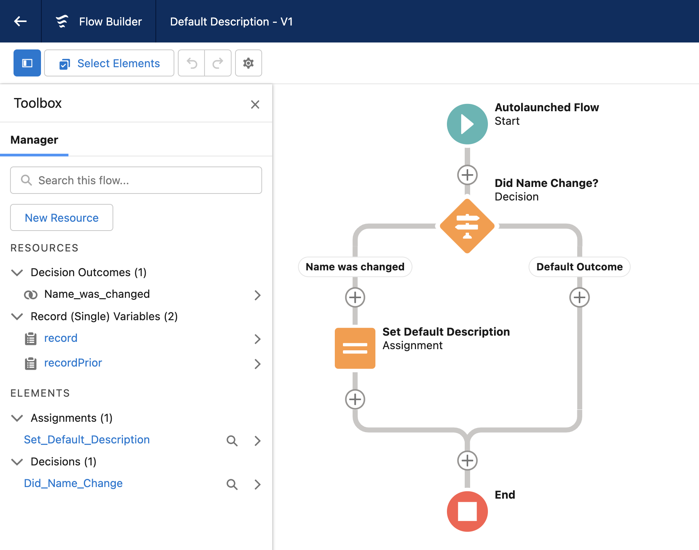

# Salesforce Trigger Actions Framework

<a href="https://githubsfdeploy.herokuapp.com?owner=mitchspano&amp;repo=apex-trigger-actions-framework">
  
</a>

This project is meant to demonstrate an Apex Trigger Framework which is built with the following goals in mind:

1. Single Trigger per sObject
2. Logic-less Triggers
3. Context Specific Implementation
4. Easy to Migrate Existing Code
5. Simple Unit Testing
6. Configuration from Setup Menu
7. Adherance to SOLID Principles

## Metadata Driven Trigger Actions

In order to use this trigger framework, we start with the `MetadataTriggerHandler` class which is included in this project.

```java
Trigger OppportunityTrigger on Opportunity (before insert, after insert, before update, after update, before delete, after delete, after undelete) {
  new MetadataTriggerHandler().run();
}
```

To define a specific action, we write an individual class which implements the correct context interface.

```java
public class ta_Opportunity_StageInsertRules implements TriggerAction.BeforeInsert {

  @TestVisible
  private static final String INVALID_STAGE_INSERT_ERROR = 'The Stage must be \'' +  Constants.  OPPORTUNITY_STAGENAME_PROSPECTING + '\' when an Opportunity is created';

  public void beforeInsert(List<Opportunity> newList){
    for (Opportunity opp : newList) {
      if (opp.StageName != Constants.OPPORTUNITY_STAGENAME_PROSPECTING) {
        opp.addError(INVALID_STAGE_INSERT_ERROR);
      }
    }
  }
}

```

This allows us to use custom metadata to configure a few things from the setup menu:

- The sObject and context for which an action is supposed to execute
- The order to take those actions within a given context
- A checkbox to bypass execution at the sObject or trigger action level

The setup menu provides a consolidated view of all of the actions that are executed when a record is inserted, updated, deleted, or undeleted.


The `MetadataTriggerHandler` class fetches all Trigger Action metadata that is configured in the org, and dynamically creates an instance of an object which implements a `TriggerAction` interface and casts it to the appropriate interface as specified in the metadata, then calls their respective context methods in the order specified.

Now, as future development work gets completed, we won't need to keep modifying the bodies of our triggerHandler classes, we can just create a new class for each new piece of functionality that we want and configure those to run in a specified order within a given context.


Note that if an Apex class is specified in metadata and it does not exist or does not implement the correct interface, a runtime error will occur.

With this multiplicity of Apex classes, it would be wise to follow a naming convention such as `ta_ObjectName_Description` and utilize the `sfdx-project.json` file to partition your application into multiple directories.

```javascript
{
  "packageDirectories": [
    {
      "path": "application/base",
      "default": true
    },
    {
      "path": "application/opportunity-automation",
      "default": false
    }
  ],
  "namespace": "",
  "sfdcLoginUrl": "https://login.salesforce.com",
  "sourceApiVersion": "50.0"
}
```

## Support for Flows

The trigger action framework can also allow you to invoke a flow by name, and determine the order of the flow's execution amongst other trigger actions in a given trigger context.

To make your flows usable, they must be auto-launched flows and you need to create the following flow resource variables depending on which context the flow is meant to be called in:

| Variable Name    | Variable Type     | Available for Input | Available for Output | Description                                                     |
| ---------------- | ----------------- | ------------------- | -------------------- | --------------------------------------------------------------- |
| newList          | Record Collection | yes                 | no                   | Used to store the Trigger.new records                           |
| oldList          | Record Collection | yes                 | no                   | Used to store the Trigger.old records                           |
| newListAfterFlow | Record Collection | no                  | yes                  | Used to apply record values back during before insert or update |

You can use the `TriggerActionFlow.getOldRecord` invocable method to get the old version of a record and see which values have changed. In order to modify field values before insert or update, we must assign all records back to the `newListAfterFlow` collection variable.

Here is an example of an auto-launched flow that checks if a Case's status has changed and if so it sets the Case's description to a default value.



To enable this flow, simply insert a trigger action record with Apex Class Name equal to "TriggerActionFlow" and set the Flow Name field with the API name of the flow itself.


## Recursion Prevention

Use the `TriggerBase.idsProcessedBeforeUpdate` and `TriggerBase.idsProcessedAfterUpdate` to prevent recursively processing the same record(s).

```java
public class ta_Opportunity_RecalculateCategory implements TriggerAction.AfterUpdate {

  public void afterUpdate(List<Opportunity> newList, List<Opportunity> oldList) {
    Map<Id,Opportunity> oldMap = new Map<Id,Opportunity>(oldList);
    List<Opportunity> oppsToBeUpdated = new List<Opportunity>();
    for (Opportunity opp : newList) {
      if (
        !TriggerBase.idsProcessedAfterUpdate.contains(opp.id) &&
        opp.StageName != oldMap.get(opp.id).StageName
      ) {
        oppsToBeUpdated.add(opp);
      }
    }
    if (!oppsToBeUpdated.isEmpty()) {
      this.recalculateCategory(oppsToBeUpdated);
    }
  }

  private void recalculateCategory(List<Opportunity> opportunities) {
    //do some stuff
    update opportunities;
  }

}

```

## Bypass Mechanisms

You can also bypass execution on either an entire sObject, or for a specific action.

### Bypass from Setup Menu

To bypass from the setup menu, simply navigate to the sObject Trigger Setting or Trigger Action metadata record you are interested in and check the Bypass Execution checkbox.


These bypasses will stay active until the checkbox is unchecked.

### Bypass from Apex

To bypass from Apex, use the static `bypass(String actionName)` method in the `MetadataTriggerHandler` class, or the static `bypass(String sObjectName)` method in the `TriggerBase` class.

```java
public void updateAccountsNoTrigger(List<Account> accountsToUpdate) {
  TriggerBase.bypass('Account');
  update accountsToUpdate;
  TriggerBase.clearBypass('Account');
}
```

```java
public void insertOpportunitiesNoRules(List<Opportunity> opportunitiesToInsert) {
  MetadataTriggerHandler.bypass('ta_Opportunity_StageInsertRules');
  insert opportunitiesToInsert;
  MetadataTriggerHandler.clearBypass('ta_Opportunity_StageInsertRules');
}
```

These bypasses will stay active until the transaction is complete or until cleared using the `clearBypass` or `clearAllBypasses` methods in the `TriggerBase` and `MetadataTriggerHandler` classes.

### Bypass Execution with Permissions

Both the `sObject_Trigger_Setting__mdt` and the `Trigger_Action__mdt` have fields called `Bypass_Permission__c` and `Required_Permission__c`. Both of these fields are optional, but they can control execution flow.

#### Bypass Permission

Developer can enter the API name of a permission in the `Bypass_Permission__c` field. If this field has a value, then the trigger/actions on this object will be bypassed if the running user has the custom permission identified. This can be helpful when assigned to an integration service-account user to facilitate large data loads, or when assigned to a system administrator for a one-time data load activity.

#### Required Permission

Developer can enter the API name of a permission in the `Required_Permission__c` field. If this field has a value, then the trigger/actions on this object will only exectute if the running user has the custom permission identified. This can be allow for new functionality to be released to a subset of users.

## Avoid Repeated Queries

It could be the case that multiple triggered actions on the same sObject require results from a query to implement their logic. In order to avoid making duplicative queries to fetch similar data, use the singleton pattern to fetch and store query results once then use them in multiple individual action classes.

```java
public class ta_Opportunity_Queries {
  private static ta_Opportunity_Queries instance;

  private ta_Opportunity_Queries() {
  }

  public static ta_Opportunity_Queries getInstance() {
    if (ta_Opportunity_Queries.instance == null) {
      ta_Opportunity_Queries.instance = new ta_Opportunity_Queries();
    }
    return ta_Opportunity_Queries.instance;
  }

  public Map<Id, Account> beforeAccountMap { get; private set; }

  public class Service implements TriggerAction.BeforeInsert {
    public void beforeInsert(List<Opportunity> newList) {
      ta_Opportunity_Queries.getInstance().beforeAccountMap = getAccountMapFromOpportunities(
        newList
      );
    }

    private Map<Id, Account> getAccountMapFromOpportunities(
      List<Opportunity> newList
    ) {
      Set<Id> accountIds = new Set<Id>();
      for (Opportunity myOpp : newList) {
        accountIds.add(myOpp.AccountId);
      }
      return new Map<Id, Account>(
        [SELECT Id, Name FROM Account WHERE Id IN :accountIds]
      );
    }
  }
}

```

Now configure the queries to be the first action to be executed within the given context, and the results will be available for any subsequent triggered action.


```java
public class ta_Opportunity_StandardizeName implements TriggerAction.BeforeInsert {
  public void beforeInsert(List<Opportunity> newList) {
    Map<Id, Account> accountIdToAccount = ta_Opportunity_Queries.getInstance()
      .beforeAccountMap;
    for (Opportunity myOpp : newList) {
      String accountName = accountIdToAccount.get(myOpp.AccountId)?.Name;
      myOpp.Name = accountName != null
        ? accountName + ' | ' + myOpp.Name
        : myOpp.Name;
    }
  }
}

```

## Use of Trigger Maps

To avoid having to downcast from `Map<Id,sObject>`, we simply construct a new map out of our `newList` and `oldList` variables:

```java
public void beforeUpdate(List<Opportunity> newList, List<Opportunity> oldList) {
  Map<Id,Opportunity> newMap = new Map<Id,Opportunity>(newList);
  Map<Id,Opportunity> oldMap = new Map<Id,Opportunity>(oldList);
  ...
}
```

This will help the transition process if you are migrating an existing Salesforce application to this new trigger actions framework.

## DML-Less Trigger Testing

Peforming DML operations is extremely computationally intensive and can really slow down the speed of your unit tests. We want to avoid this at all costs. Traditionally, this has not been possible with existing Apex Trigger frameworks, but this Trigger Action approach makes it much easier. Included in this project is a `TestUtility` class which allows us to generate fake record Ids.

```java
@IsTest
public class TestUtility {

  static Integer myNumber = 1;

  public static Id getFakeId(Schema.SObjectType sObjectType)  {
    String result = String.valueOf(myNumber++);
    return (Id)(sObjectType.getDescribe().getKeyPrefix() + '0'.repeat(12-result.length()) + String.valueOf(myNumber++));
  }

}
```

We can also use `getErrors()` method to test the `addError(errorMsg)` method of the `SObject` class.

Take a look at how both of these are used in the `ta_Opportunity_StageChangeRulesTest` class:

```java
@IsTest
private static void beforeUpdate_test() {
  List<Opportunity> newList = new List<Opportunity>();
  List<Opportunity> oldList = new List<Opportunity>();
  //generate fake Id
  Id myRecordId = TestUtility.getFakeId(Opportunity.SObjectType);
  newList.add(new Opportunity(Id = myRecordId, StageName = Constants.OPPORTUNITY_STAGENAME_CLOSED_WON));
  oldList.add(new Opportunity(Id = myRecordId, StageName = Constants.OPPORTUNITY_STAGENAME_QUALIFICATION));
  Test.startTest();
  new ta_Opportunity_StageChangeRules().beforeUpdate(newList, oldList);
  Test.stopTest();
  //Use getErrors() SObject method to get errors from addError without performing DML
  System.assertEquals(true, newList[0].hasErrors());
  System.assertEquals(1, newList[0].getErrors().size());
  System.assertEquals(
    newList[0].getErrors()[0].getMessage(),
    String.format(
      ta_Opportunity_StageChangeRules.INVALID_STAGE_CHANGE_ERROR,
      new String[] {
        Constants.OPPORTUNITY_STAGENAME_QUALIFICATION,
        Constants.OPPORTUNITY_STAGENAME_CLOSED_WON
      }
    )
  );
}
```

Notice how we performed _zero_ DML operations yet we were able to cover all of the logic of our class in this particular test. This can help save a lot of computational time and allow for much faster execution of Apex tests.
