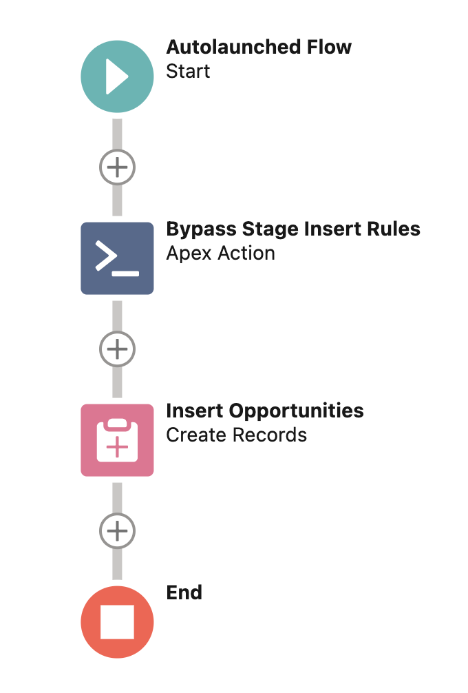
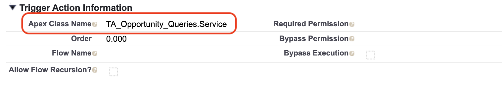

# Apex Trigger Actions Framework

<a href="https://githubsfdeploy.herokuapp.com?owner=mitchspano&amp;repo=apex-trigger-actions-framework">
  
</a>

#### [Unlocked Package Installation (Production)](https://login.salesforce.com/packaging/installPackage.apexp?p0=04t3h000004OYREAA4)

#### [Unlocked Package Installation (Sandbox)](https://test.salesforce.com/packaging/installPackage.apexp?p0=04t3h000004OYREAA4)

---

## Overview

The Apex Trigger Actions Framework allows developers and administrators to partition, order, and bypass record-triggered automations for applications built on Salesforce.com.

The framework supports both Apex and Flow - which empowers developers and administrators to define automations in the tool of their choice, then plug them together harmoniously.

With granular control of the relative order of execution of Apex vs. Flow and standardized bypass mechanisms, the framework enables an "Automation Studio" view of _all_ automations for a given sObject.

## Metadata Driven Trigger Actions

With the Trigger Actions Framework, we use [custom metadata](https://help.salesforce.com/s/articleView?id=sf.custommetadatatypes_overview.htm&type=5) to configure our trigger logic from the setup menu. The custom metadata defines:

- The sObject and context for which an action is supposed to execute
- The order to take those actions within a given context
- Mechanisms to determine if and when the action should be [bypassed](#bypass-mechanisms)

The related lists on the `SObject_Trigger_Setting__mdt` record provide a consolidated and ordered view of _all_ of the Apex and Flow actions that will be executed when a record is inserted, updated, deleted, or undeleted:


The Trigger Actions Framework conforms strongly to the [Open–closed principle](https://en.wikipedia.org/wiki/Open%E2%80%93closed_principle) and the [Single-responsibility principle](https://en.wikipedia.org/wiki/Single-responsibility_principle). To add or modify trigger logic in our Salesforce org, we won't need to keep modifying the body of a TriggerHandler class; we can create a class or a flow with responsibility scoped to the automation we are trying to build and configure these actions to run in a specified order within a given trigger context.

The work is performed in the `MetadataTriggerHandler` class which implements the the [Strategy Pattern](https://en.wikipedia.org/wiki/Strategy_pattern) by fetching all Trigger Action metadata that is configured in the org for the given trigger context and uses [reflection](https://en.wikipedia.org/wiki/Reflective_programming) to dynamically instantiate an object which implements a `TriggerAction` interface, then casts the object to the appropriate interface as specified in the metadata and calls the respective context methods in the order specified.

Note that if an Apex class is specified in metadata and it does not exist or does not implement the correct interface, a runtime error will occur.

---

### Enabling on an SObject

To get started, call the the `MetadataTriggerHandler` class within the body of the trigger of the sObject:

```java
trigger OpportunityTrigger on Opportunity (
  before insert,
  after insert,
  before update,
  after update,
  before delete,
  after delete,
  after undelete
) {
  new MetadataTriggerHandler().run();
}
```

Next, create a row in the `SObject_Trigger_Setting__mdt` custom metadata type which corresponds to the sObject that we want to enable usage of the framework on - in this case, it would be Opportunity.


## Apex Actions

To define a specific action, we write an individual class which implements the applicable interface(s):

```java
public class TA_Opportunity_StageInsertRules implements TriggerAction.BeforeInsert {

  @TestVisible
  private static final String PROSPECTING = 'Prospecting';
  @TestVisible
  private static final String INVALID_STAGE_INSERT_ERROR = 'The Stage must be \'Prospecting\' when an Opportunity is created';

  public void beforeInsert(List<Opportunity> newList){
    for (Opportunity opp : newList) {
      if (opp.StageName != PROSPECTING) {
        opp.addError(INVALID_STAGE_INSERT_ERROR);
      }
    }
  }
}
```

Then create a row within the `Trigger_Action__mdt` custom metadata type to call the action in the specified order on the sObject.


---

## Flow Actions

The Apex Trigger Actions Framework can also allow you to invoke a flow by name, and determine the order of the flow's execution amongst other trigger actions in a given trigger context. Here is an example of a trigger action flow that checks if a record's name has changed and if so it sets the record's description to a default value.


### Define a Flow

To make your flows usable, they must be auto-launched flows and you need to create the following flow resource variables:

| Variable Name | Variable Type | Available for Input | Available for Output | Description                                        | Available Contexts       |
| ------------- | ------------- | ------------------- | -------------------- | -------------------------------------------------- | ------------------------ |
| record        | record        | yes                 | yes                  | the new version of the record in the DML operation | insert, update, undelete |
| recordPrior   | record        | yes                 | no                   | the old version of the record in the DML operation | update, delete           |

To enable this flow, simply insert a trigger action record with `Apex_Class_Name__` equal to `TriggerActionFlow` and set the `Flow_Name__c` field with the API name of the flow itself. You can select the `Allow_Flow_Recursion__c` checkbox to allow flows to run recursively (advanced).


---

## Compatibility with sObjects from Installed Packages

The Trigger Actions Framework supports standard objects, custom objects, and objects from installed packages. To use the framework with an object from an installed package, separate the Object API Name from the Object Namespace on the sObject Trigger Setting itself. For example, if you want to use the Trigger Actions Framework on an sObject called `Acme__Explosives__c`, configure the sObject Trigger Setting like this:

| Object Namespace | Object API Name |
| ---------------- | --------------- |
| Acme             | Explosives\_\_c |

---

## Recursion Prevention

Use the `TriggerBase.idToNumberOfTimesSeenBeforeUpdate` and `TriggerBase.idToNumberOfTimesSeenAfterUpdate` to prevent recursively processing the same record(s).

```java
public class TA_Opportunity_RecalculateCategory implements TriggerAction.AfterUpdate {

  public void afterUpdate(List<Opportunity> newList, List<Opportunity> oldList) {
    Map<Id,Opportunity> oldMap = new Map<Id,Opportunity>(oldList);
    List<Opportunity> oppsToBeUpdated = new List<Opportunity>();
    for (Opportunity opp : newList) {
      if (
        TriggerBase.idToNumberOfTimesSeenAfterUpdate.get(opp.id) == 1 &&
        opp.StageName != oldMap.get(opp.id).StageName
      ) {
        oppsToBeUpdated.add(opp);
      }
    }
    if (!oppsToBeUpdated.isEmpty()) {
      this.recalculateCategory(oppsToBeUpdated);
    }
  }

  private void recalculateCategory(List<Opportunity> opportunities) {
    //do some stuff
    update opportunities;
  }

}
```

---

## Bypass Mechanisms

The framework provides standardized bypass mechanisms to control execution on either an entire sObject, or for a specific action.

### Bypass Execution Globally

To bypass from the setup menu, simply navigate to the sObject Trigger Setting or Trigger Action metadata record you are interested in and check the Bypass Execution checkbox.


These bypasses will stay active until the checkbox is unchecked.

### Bypass Execution for a Transaction

You can bypass all actions on an sObject as well as specific Apex or Flow actions for the remainder of the transaction using Apex or Flow.

#### Bypass from Apex

To bypass from Apex, use the static `bypass(String name)` method in the `TriggerBase`, `MetadataTriggerHandler`, or `TriggerActionFlow` classes.

```java
public void updateAccountsNoTrigger(List<Account> accountsToUpdate) {
  TriggerBase.bypass('Account');
  update accountsToUpdate;
  TriggerBase.clearBypass('Account');
}
```

```java
public void insertOpportunitiesNoRules(List<Opportunity> opportunitiesToInsert) {
  MetadataTriggerHandler.bypass('TA_Opportunity_StageInsertRules');
  insert opportunitiesToInsert;
  MetadataTriggerHandler.clearBypass('TA_Opportunity_StageInsertRules');
}
```

```java
public void updateContactsNoFlow(List<Contacts> contactsToUpdate) {
  TriggerActionFlow.bypass('Contact_Flow');
  update contactsToUpdate;
  TriggerActionFlow.clearBypass('Contact_Flow');
}
```

#### Bypass from Flow

To bypass from Flow, use the `TriggerActionFlowBypass.bypass` invocable method. You can set the `Bypass Type` to `Apex`, `Object`, or `Flow`, then pass the API name of the sObject, class, or flow you would like to bypass into the `Name` field.

|                             Flow                             |               Invocable Action Setup               |
| :----------------------------------------------------------: | :------------------------------------------------: |
|  |  |

#### Clear Apex and Flow Bypasses

The Apex and Flow bypasses will stay active until the transaction is complete or until cleared using the `clearBypass` or `clearAllBypasses` methods in the `TriggerBase`, `MetadataTriggerHandler`, or `TriggerActionFlow` classes. There are also corresponding invocable methods in the `TriggerActionFlowClearBypass` and `TriggerActionFlowClearAllBypasses` which will perform the same resetting of the bypass. To use these invocable methods, set the `bypassType` to `Apex`, `Object`, or `Flow`, then to clear a specific bypass set the API name of the sObject, class, or flow you would like to clear the bypass for into the `name` field.

### Bypass Execution for Specific Users

Both the `sObject_Trigger_Setting__mdt` and the `Trigger_Action__mdt` have fields called `Bypass_Permission__c` and `Required_Permission__c`. Both of these fields are optional, but they can control execution flow for specific users.

#### Bypass Permission

Developers can enter the API name of a permission in the `Bypass_Permission__c` field. If this field has a value, then the trigger/action will be bypassed if the running user has the custom permission identified. This can be helpful when assigned to an integration service-account user to facilitate large data loads, or when assigned to a system administrator for a one-time data load activity.

#### Required Permission

Developers can enter the API name of a permission in the `Required_Permission__c` field. If this field has a value, then the trigger/action will only execute if the running user has the custom permission identified. This can be allow for new functionality to be released to a subset of users.

---

## Avoid Repeated Queries

It could be the case that multiple triggered actions on the same sObject require results from a query to implement their logic. In order to avoid making duplicative queries to fetch similar data, use the Singleton pattern to fetch and store query results once then use them in multiple individual action classes.

```java
public class TA_Opportunity_Queries {
  private static TA_Opportunity_Queries instance;

  private TA_Opportunity_Queries() {
  }

  public static TA_Opportunity_Queries getInstance() {
    if (TA_Opportunity_Queries.instance == null) {
      TA_Opportunity_Queries.instance = new TA_Opportunity_Queries();
    }
    return TA_Opportunity_Queries.instance;
  }

  public Map<Id, Account> beforeAccountMap { get; private set; }

  public class Service implements TriggerAction.BeforeInsert {
    public void beforeInsert(List<Opportunity> newList) {
      TA_Opportunity_Queries.getInstance().beforeAccountMap = getAccountMapFromOpportunities(
        newList
      );
    }

    private Map<Id, Account> getAccountMapFromOpportunities(
      List<Opportunity> newList
    ) {
      Set<Id> accountIds = new Set<Id>();
      for (Opportunity myOpp : newList) {
        accountIds.add(myOpp.AccountId);
      }
      return new Map<Id, Account>(
        [SELECT Id, Name FROM Account WHERE Id IN :accountIds]
      );
    }
  }
}
```

Now configure the queries to be the first action to be executed within the given context, and the results will be available for any subsequent triggered action.


With the `TA_Opportunity_Queries` class configured as the first action, all subsequent actions can use `TA_Opportunity_Queries.getInstance()` to fetch the query results.

```java
public class TA_Opportunity_StandardizeName implements TriggerAction.BeforeInsert {
  public void beforeInsert(List<Opportunity> newList) {
    Map<Id, Account> accountIdToAccount = TA_Opportunity_Queries.getInstance()
      .beforeAccountMap;
    for (Opportunity myOpp : newList) {
      String accountName = accountIdToAccount.get(myOpp.AccountId)?.Name;
      myOpp.Name = accountName != null
        ? accountName + ' | ' + myOpp.Name
        : myOpp.Name;
    }
  }
}
```

**Note:**
In the example above, the top level class is the implementation of the Singleton pattern, but we also define an inner class called `Service` which is the actual Trigger Action itself. When using this pattern for query management, the `Apex_Class_Name__c` value on the `Trigger_Action__mdt` row would be `TA_Opportunity_Queries.Service`.



---

## Use of Trigger Maps

To avoid having to downcast from `Map<Id,sObject>`, we simply construct a new map out of our `newList` and `oldList` variables:

```java
public void beforeUpdate(List<Opportunity> newList, List<Opportunity> oldList) {
  Map<Id,Opportunity> newMap = new Map<Id,Opportunity>(newList);
  Map<Id,Opportunity> oldMap = new Map<Id,Opportunity>(oldList);
  ...
}
```

This will help the transition process if you are migrating an existing Salesforce application to this new trigger actions framework.

---

## DML-Less Trigger Testing

Performing DML operations is extremely computationally intensive and can really slow down the speed of your unit tests. We want to avoid this at all costs. Traditionally, this has not been possible with existing Apex Trigger frameworks, but this Trigger Action approach makes it much easier. Included in this project is a `TriggerTestUtility` class which allows us to generate fake record Ids.

```java
@IsTest
public class TriggerTestUtility {
  static Integer myNumber = 1;

  public static Id getFakeId(Schema.SObjectType sObjectType) {
    String result = String.valueOf(myNumber++);
    return (Id) (sObjectType.getDescribe().getKeyPrefix() +
    '0'.repeat(12 - result.length()) +
    result);
  }
}
```

We can also use `getErrors()` method to test the `addError(errorMsg)` method of the `SObject` class.

Take a look at how both of these are used in the `TA_Opportunity_StageChangeRulesTest` class:

```java
@IsTest
private static void invalidStageChangeShouldPreventSave() {
  List<Opportunity> newList = new List<Opportunity>();
  List<Opportunity> oldList = new List<Opportunity>();
  //generate fake Id
  Id myRecordId = TriggerTestUtility.getFakeId(Opportunity.SObjectType);
  newList.add(
    new Opportunity(
      Id = myRecordId,
      StageName = Constants.OPPORTUNITY_STAGENAME_CLOSED_WON
    )
  );
  oldList.add(
    new Opportunity(
      Id = myRecordId,
      StageName = Constants.OPPORTUNITY_STAGENAME_QUALIFICATION
    )
  );

  new TA_Opportunity_StageChangeRules().beforeUpdate(newList, oldList);

  //Use getErrors() SObject method to get errors from addError without performing DML
  System.assertEquals(
    true,
    newList[0].hasErrors(),
    'The record should have errors'
  );
  System.assertEquals(
    1,
    newList[0].getErrors().size(),
    'There should be exactly one error'
  );
  System.assertEquals(
    newList[0].getErrors()[0].getMessage(),
    String.format(
      TA_Opportunity_StageChangeRules.INVALID_STAGE_CHANGE_ERROR,
      new List<String>{
        Constants.OPPORTUNITY_STAGENAME_QUALIFICATION,
        Constants.OPPORTUNITY_STAGENAME_CLOSED_WON
      }
    ),
    'The error should be the one we are expecting'
  );
}
```

Notice how we performed _zero_ DML operations yet we were able to cover all of the logic of our class in this particular test. This can help save a lot of computational time and allow for much faster execution of Apex tests.

---

## DML Finalizers

The Apex Trigger Actions Framework now has support for a novel feature not found in other Trigger frameworks; DML finalizers.

A DML finalizer is a piece of code that executes **exactly one time** at the very end of a DML operation.

This is notably different than the final action within a given trigger context. The final configured action can be executed multiple times in case of cascading DML operations within trigger logic or when more than 200 records are included in the original DML operation. This can lead to challenges capturing logs or invoking asynchronous logic.

DML finalizers can be very helpful for things such as _enqueuing a queuable operation_ or _inserting a collection of gathered logs_.

Finalizers within the Apex Trigger Actions Framework operate using many of the same mechanisms. First define a class which implements the `TriggerAction.DmlFinalizer` interface.

```java
public with sharing class OpportunityCategoryCalculator implements Queueable, TriggerAction.DmlFinalizer {
  private static List<Opportunity> toProcess = new List<Opportunity>();
  private List<Opportunity> currentlyProcessing;

  public static void registerOpportunities(List<Opportunity> toRecalculate) {
    toProcess.addAll(toRecalculate);
  }

  public void execute() {
    if (!toProcess.isEmpty()) {
      this.currentlyProcessing = toProcess;
      System.enqueueJob(this);
      toProcess.clear();
    }
  }

  public void execute(System.QueueableContext qc) {
    // do some stuff
  }
}

```

Then create a corresponding row of `DML_Finalizer__mdt` to invoke your finalizer in the order specified.


Finally, use static variables or within your trigger actions to register data to be used in the finalizer's execution.

```java
public with sharing class TA_Opportunity_RecalculateCategory implements TriggerAction.AfterUpdate {

  public void afterUpdate(
    List<Opportunity> newList,
    List<Opportunity> oldList
  ) {
    Map<Id, Opportunity> oldMap = new Map<Id, Opportunity>(oldList);
    List<Opportunity> toRecalculate = new List<Opportunity>();
    for (Opportunity opp : newList) {
      if (opp.Amount != oldMap.get(opp.Id).Amount) {
        toRecalculate.add(opp);
      }
    }
    if (!toRecalculate.isEmpty()) {
      OpportunityCategoryCalculator.registerOpportunities(toRecalculate);
    }
  }
}
```

### DML Finalizer Caveats

> [!WARNING]  
> DML Finalizers are brand new and should be considered as _experimental_. If you encounter any issues when using them, please create an issue on the GitHub repository.

#### Independent of SObject

To ensure that cascading DML operations are supported, all configured finalizers within the org are invoked at the end of any DML operation, regardless of the SObject of the original triggering operation.

#### Universal Adoption

To use a DML Finalizer, the Apex Trigger Actions Framework must be enabled on every SObject which supports triggers which will have a DML operation on it during a transaction, and enabled in all trigger contexts on those sObjects. If DML is performed on an SObject that has a trigger which does not use the framework, the system will not be able to detect when to finalize the DML operation.

#### Offsetting the Number of DML Rows

Detecting when to finalize the operation requires knowledge of the total number of records passed to the DML operation. Unfortunately, there is no bulletproof way of how to do this currently in Apex; the best thing we can do is to rely on `Limits.getDmlRows()` to infer the number of records passed to the DML operation.

This works in most cases, but certain operations such as setting a `System.Savepoint` consume a DML row which can throw off the counts and remove our ability to detect when to finalize. In order to avoid this problem, use the `TriggerBase.offsetExistingDmlRows()` method before calling the first DML operation within your Apex.

```java
List<Account> toInsert = new List<Account>();
for (Integer i = 0; i < 250; i++) {
	toInsert.add(new Account(Name = 'Acme' + i));
}

Savepoint sp = Database.setSavepoint();
TriggerBase.offsetExistingDmlRows();
insert toInsert;
```

#### Wait to Finalize

It could be the case that you have multiple DML operations in a row and you would like the system to wait to finalize until they are all complete. For example, in a Lightning Web Component's controller:

```java
@AuraEnabled
public static void foo(){
  Account acme = new Account(
    Name = 'Acme'
  );
  insert acme; // finalizer is called here
  Account acmeExplosives = new Account(
    Name = 'Acme-Explosives',
    ParentId = acme.Id,
  );
  insert acmeExplosives; // second finalizer is called here
}
```

To facilitate these needs, call the `TriggerBase.waitToFinalize()` and `TriggerBase.nowFinalize()` methods:

```java
@AuraEnabled
public static void foo(){
  TriggerBase.waitToFinalize();
  Account acme = new Account(
    Name = 'Acme'
  );
  insert acme;
  Account acmeExplosives = new Account(
    Name = 'Acme-Explosives',
    ParentId = acme.Id,
  );
  insert acmeExplosives;
  TriggerBase.nowFinalize();  // single finalizer is called here
}
```

#### Handle Multiple Finalizers per Transaction

Sometimes it is infeasible for the system to be told to `waitToFinalize` - for example: when the composite API is called. To make sure our finalizers can safely these scenarios, be sure to guard your finalizers against multiple invocations in one transaction by clearing out any collections of records you need to process:

```java
public void execute() {
  if (!toProcess.isEmpty()) {
    this.currentlyProcessing = toProcess;
    System.enqueueJob(this);
    toProcess.clear();
  }
}
```
